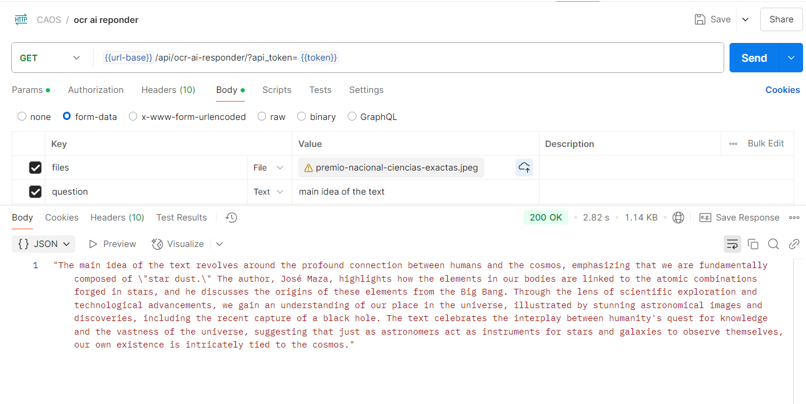

# OCR and AI Responder

This project is a Django REST API that processes images and PDFs to extract text using OCR (Optical Character Recognition) and then generates responses to questions based on the extracted text using an AI model.

## Features
- Extract text from images (JPG, PNG) and PDFs.
- Generate prompts based on extracted text and user questions.
- Use AI to generate responses based on the prompts.

## Libraries Used in the Project

### 1. OpenCV (cv2)
- **`import cv2`**:
  - **Function**: Computer vision library used for image processing, such as converting to grayscale and applying thresholds.

### 2. Tesseract OCR
- **`import pytesseract`**:
  - **Function**: Library that provides an interface to Tesseract OCR, a tool for extracting text from images.

- **`pytesseract.pytesseract.tesseract_cmd`**:
  - **Function**: Configures the path to the Tesseract OCR executable on your system.

### 3. BytesIO
- **`from io import BytesIO`**:
  - **Function**: Provides a way to handle binary data in memory, useful for working with files in binary format.

### 4. NumPy
- **`import numpy as np`**:
  - **Function**: Fundamental library for scientific computing in Python, used here to convert images to NumPy arrays for processing with OpenCV.

## Installation

1. Clone the repository:
   ```sh
   git clone https://github.com/yourusername/ocr-ai-responder.git
   cd ocr-ai-responder


